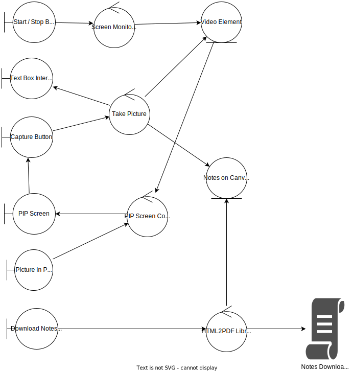

# Extension To Take the Screen-shot notes on any website

## Extension Permissions:
* desktopCapture Chrome API

## Interface Demo and Description
### https://snapdesk.softo.tech

## Detailed Working through Design Document

## Resources Used
1. Mozilla Web Extension Polyfill: 
https://github.com/mozilla/webextension-polyfill/
1. Side Bar Collapse
https://www.w3schools.com/howto/howto_js_collapse_sidebar.asp
1. Chrome Developers
https://developer.chrome.com/docs/extensions/mv3/content_scripts/
1. Chrome Developers Manifest V2
https://developer.chrome.com/docs/extensions/mv3/content_scripts/
1. Side Bar stackOverflow
https://stackoverflow.com/questions/39610205/how-to-make-side-panel-in-chrome-extension
1. Minimize Layout Shift
https://developers.google.com/publisher-tag/guides/minimize-layout-shift
1. License Terms
https://github.com/kenpusney/proprietary
